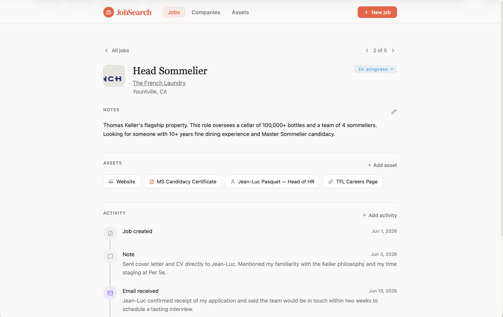

# Job Search Tracker

A personal job-search management app that connects job opportunities, contacts, documents, and activity into a single system.

Designed and built as an independent project using AI-assisted development.

[Read the case study →](https://hellovaler.io/work/perso-02-jobsearch)

## What it does

- Tracks job opportunities and application status
- Connects contacts, activities, and documents to individual opportunities
- Provides a timeline of activity for each opportunity
- Captures jobs directly from job sites through a Chrome extension
- Supports filtering and browsing across the system

## Built with

- Next.js
- TypeScript
- Tailwind CSS
- Notion
- Chrome Extension APIs
- AI-assisted development
- Vercel

## About the project

I'm a product designer rather than a software engineer. I designed and built this product using coding agents, allowing me to take the project beyond prototypes into working software that I could use and iterate on directly.

The case study covers the design process, how the system evolved through use, and what building a working product changed about my design practice.
